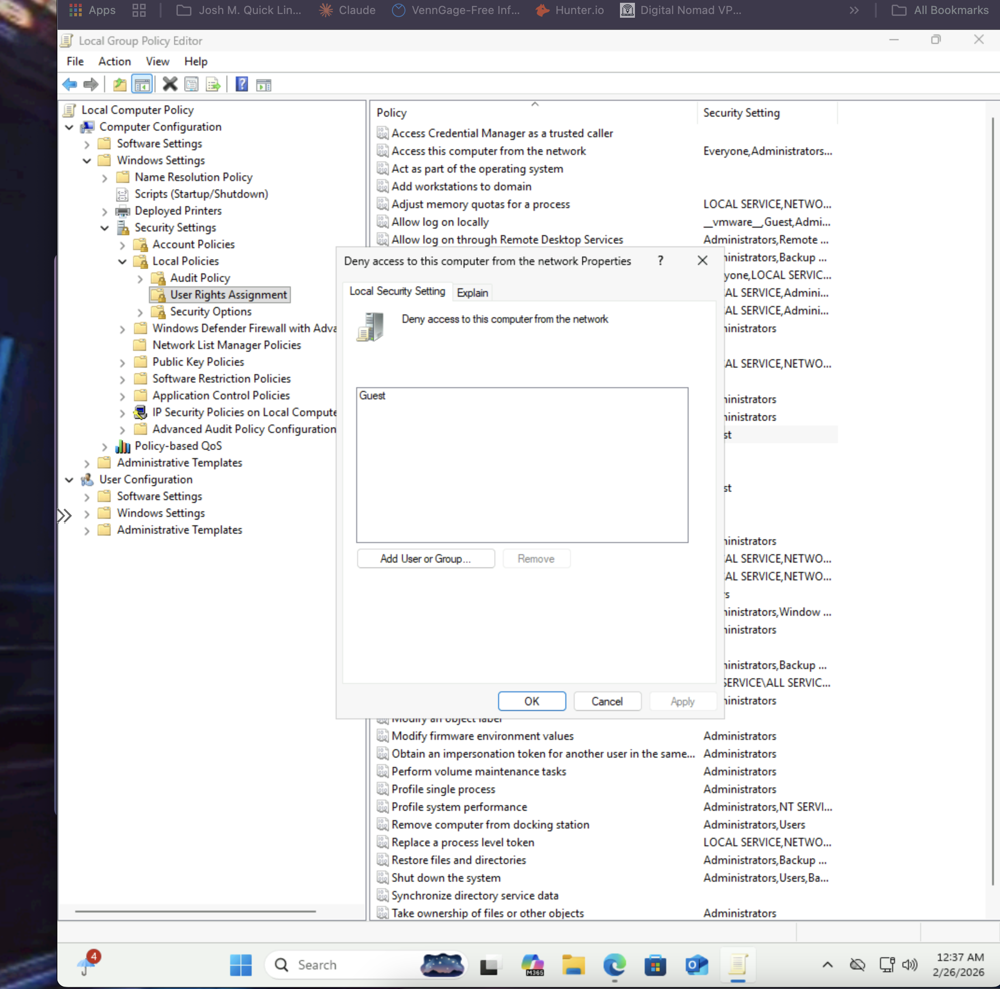
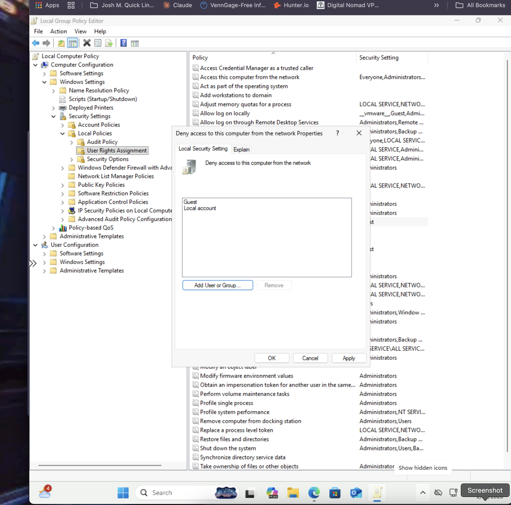
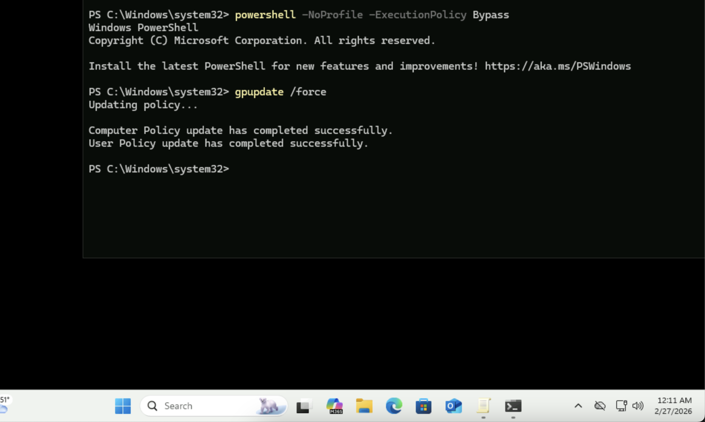
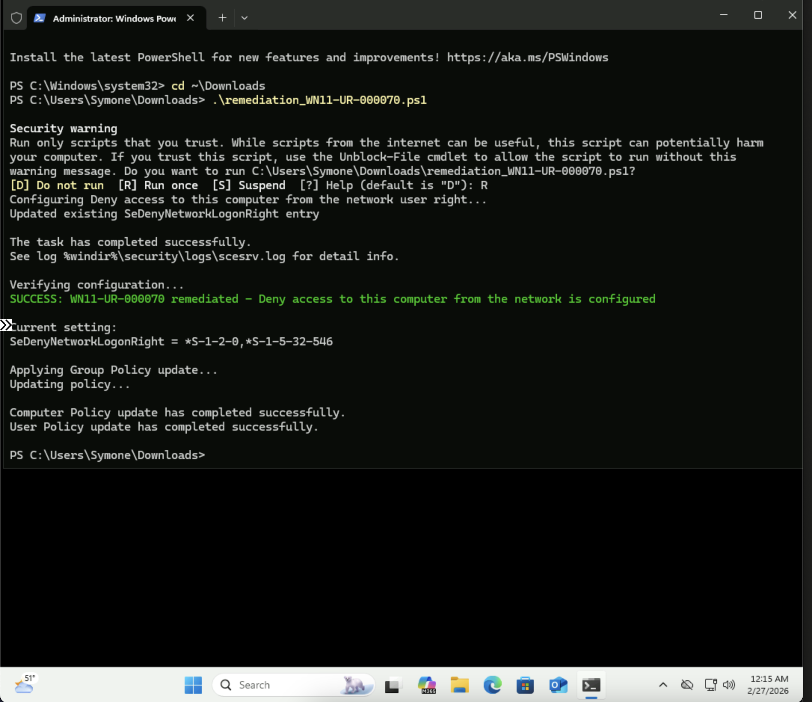
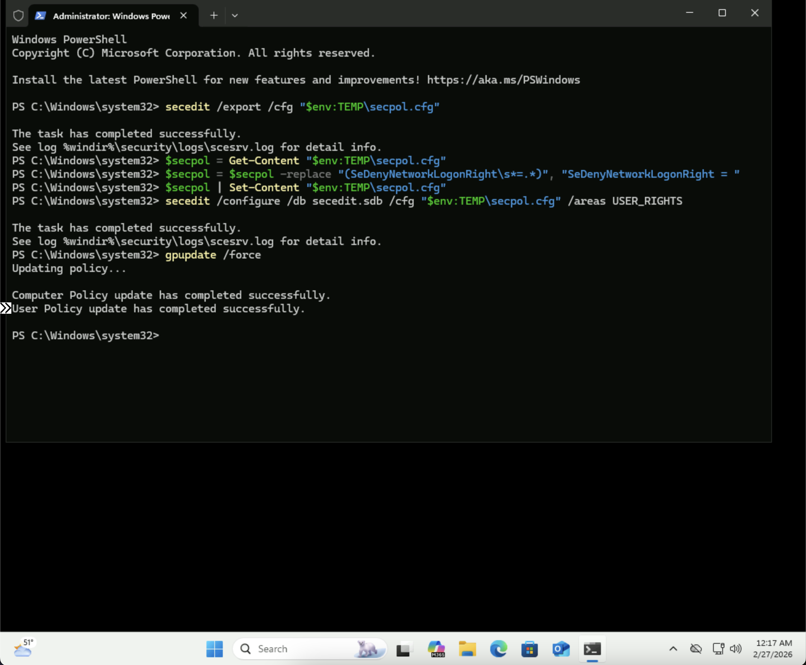

# Windows STIG WN11-UR-000070 Remediation
## Overview
This repository contains remediation for STIG vulnerability WN11-UR-000070: "The 'Deny access to this computer from the network' user right on workstations must be configured to prevent access from highly privileged domain accounts and local accounts."
## Vulnerability Details
- **STIG-ID**: WN11-UR-000070
- **Vuln-ID**: V-253491
- **Severity**: CAT II
- **Description**: Restricting network access to privileged and local accounts reduces the attack surface of the system. Without this restriction, unauthorized users or accounts could potentially access the system over the network, increasing the risk of lateral movement and privilege escalation.
## Remediation Methods
### Automated (PowerShell Script)
Run the `remediation_WN11-UR-000070.ps1` script as Administrator to automatically configure the required user right.
**To run:**
```powershell
PS C:\> .\remediation_WN11-UR-000070.ps1
```
### Manual (Group Policy Editor)
1. Open Local Group Policy Editor (`gpedit.msc`)
2. Navigate to: `Computer Configuration` → `Windows Settings` → `Security Settings` → `Local Policies` → `User Rights Assignment`
3. Double-click **"Deny access to this computer from the network"**
4. Click **Add User or Group**
5. Type `Guests` → click **OK**
6. Click **Add User or Group** again
7. Type `Local account` → click **OK**
8. Click **Apply** → **OK**
9. Open PowerShell as Administrator and run: `gpupdate /force`
## Screenshots
### Before - Only Guest Account Listed

### After - Guest and Local Account Added

### Manual - Group Policy Force Update

### PowerShell Automated Remediation Success

### Rollback Confirmation

## Testing Information
- **Tested By**: Symone-Marie Priester
- **Date Tested**: February 25-26, 2026
- **System**: Windows 11 (Version 10.0.26200.7623)
- **PowerShell Version**: 5.1
- **Methods**: Both automated (PowerShell) and manual (Group Policy Editor)
## Repository Structure
```
├── remediation_WN11-UR-000070.ps1            # PowerShell remediation script
├── WN11-UR-000070_DenyNetwork_Before.png     # Before - only Guest listed
├── WN11-UR-000070_DenyNetwork_After.png      # After - Guest and Local account added
├── WN11-UR-000070_gpupdate_force_Manual.png  # Manual - Group Policy force update
├── WN11-UR-000070_Programmatic_Remediation.png  # PowerShell remediation success
├── WN11-UR-000070_Rollback_Confirmation.png  # Rollback confirmation
└── README.md                                  # This file
```
## Author
**Symone-Marie Priester**
- LinkedIn: [linkedin.com/in/symone-mariepriester](https://linkedin.com/in/symone-mariepriester)
- GitHub: [github.com/Symone-Marie](https://github.com/Symone-Marie)
